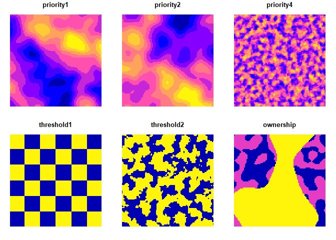
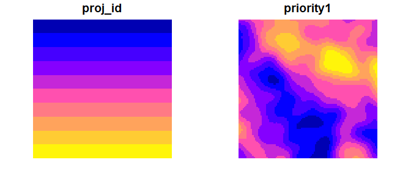
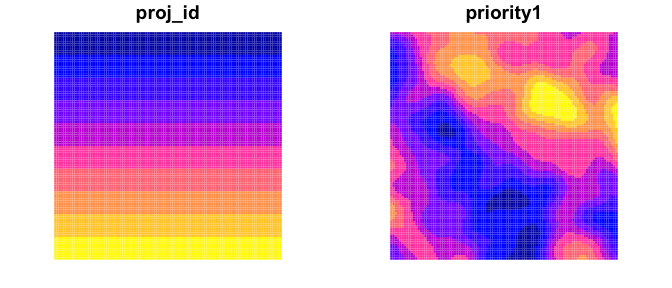
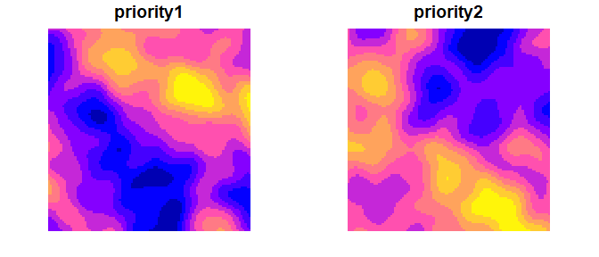
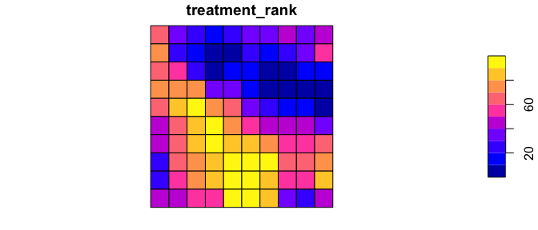
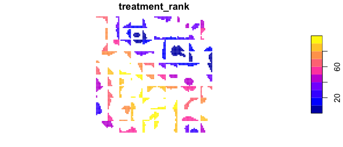
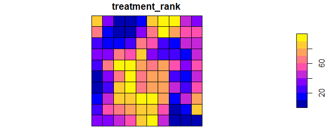

ForSysR
================

<!--- README.md is generated from README.Rmd. Please edit that file -->


## Scenario planning for land management

ForSys a land management planning model that explores potential outcomes
of a range of possible priorities, including but not limited to
landscape restoration and hazardous fuel management. The model is
spatially explicit and uses multi-criteria prioritization and
optimization methods that can rapidly process scenarios that range from
small to very large-scales (\~10,000 acres to more than 180 million
acres). The previous iteration of the ForSys program was called the
Landscape Treatment Designer (LTD), and was used in several published
studies. ForSys has been used in several research and applied case
studies at a range of scales (projects, forests, states, continental
United States) to prioritize landscape-scale treatments (see case
studies). ForSys is available in a windows desktop GUI (ForSysX) and an
R version (ForSysR).

## Installation

The current official version of the *forsys* package can be installed
from [GitHub](https://github.com/forsys-sp/forsysr/) using the following
code. The repository is private, so users need to create a personal
access token in order to install the package in R. The token can be
generated by going to the following url
(<https://github.com/settings/tokens>): (1) log into your github
account, (2) add a brief description to the token (required), (3) set
the expiration date, and (4) click on the checkbox for ‘repo’. Add that
token text string to the *remotes::install_github* function below and R
will download and install the *forsys* package to your computer. (Note
that in order to use Patchmax, you also need to install that package as
well). We recommend updating other packages when prompted.

``` r
if (!require(remotes)) install.packages("remotes")
remotes::install_github("forsys-sp/forsysr", auth_token = 'your_token_here')
remotes::install_github("forsys-sp/patchmax", auth_token = 'your_token_here')
```

## Usage

Here we will provide a short example showing how the *forsys* package
can be used to build and solve simple multi-objective landscape
management problems. For brevity, we will use one of the built-in
simulated datasets that is distributed with the package. First, we will
load the *forsys* package.

``` r
library(forsys)

# In order to run the examples below, these additional libraries are required:
library(sf)
library(dplyr)
```

### Loading data

Although *forsys* can support many different types of treatment unit
data, here our treatment units are represented as polygons in a spatial
vector format. Each polygon represents a different treatment unit.

``` r
# load treatment unit data
data(test_forest)
# show the first rows in the attribute table
head(test_forest)
```

    ## Simple feature collection with 6 features and 10 fields
    ## Geometry type: POLYGON
    ## Dimension:     XY
    ## Bounding box:  xmin: -1805472 ymin: 2689815 xmax: -1799472 ymax: 2690815
    ## Projected CRS: NAD83 / Conus Albers
    ## # A tibble: 6 x 11
    ##   stand_id proj_id area_ha priority1 priority2 priority3 priority4 threshold1
    ##      <int>   <int>   <dbl>     <dbl>     <dbl>     <dbl>     <dbl>      <dbl>
    ## 1        1       1     100     0.417     0.526     0.483     0.513          1
    ## 2        2       1     100     0.418     0.488     0.482     0.646          1
    ## 3        3       1     100     0.419     0.452     0.482     0.661          1
    ## 4        4       1     100     0.422     0.420     0.481     0.604          1
    ## 5        5       1     100     0.428     0.392     0.479     0.621          1
    ## 6        6       1     100     0.438     0.369     0.477     0.514          1
    ## # ... with 3 more variables: threshold2 <dbl>, ownership <dbl>,
    ## #   geometry <POLYGON [m]>

``` r
# plot the treatment units
plot(test_forest[,c(4:5,7:10)], border=NA)
```



### Running a ForSys Scenario

*Forsys* prioritizes projects by maximizing an objective given one or
more constraints. The objectives represent one or more management
priorities while the constraints may include a maximum cost or area
treated. Thresholds are environmental or categorical conditions that
trigger the need to treat an indiviudal treatment unit or stand (e.g., a
particular ownership or minimum forest cover). *Forsys* then builds
projects and ranks them in order of their priority. Projects can be
either predefined units (e.g., watersheds) or can be built dynamically.

Let’s set up a very simple *forsys* run to see how things work. We’ll
use the test_forest data shown above. We want to find the top 2000 ha
within each predefined project based on ‘priority1’.

``` r
plot(test_forest[,c('proj_id','priority1')], border=NA)
```

<!-- -->

We run *forsys* with the following arguments. Remember that these can
also be run using the json config file, as described above. *Forsys*
always writes its outputs to csv files saved within the output folder,
but we can optionally set it to write that data out to a list which has
three elements containing the outputs.

``` r
stand_dat <- test_forest %>% st_drop_geometry()

run_outputs <- forsys::run(
  return_outputs = TRUE,
  scenario_name = "test_scenario",
  stand_data = stand_dat,
  stand_id_field = "stand_id",
  proj_id_field = "proj_id",
  stand_area_field = "area_ha",
  scenario_priorities = "priority1",
  scenario_output_fields = c("area_ha", "priority1", "priority2", "priority3", "priority4"),
  proj_fixed_target =  TRUE,
  proj_target_field = "area_ha",
  proj_target_value = 2000
)
```

Not surprisingly, the treatment rank of the projects selected
corresponds directly to those areas where are priority was highest, as
plotted below. Projeck rank \#1 (darkest blue) is the highest ranked
project.

``` r
plot_dat <- test_forest %>%
  group_by(proj_id) %>% summarize() %>%
  left_join(run_outputs$project_output %>% select(proj_id, treatment_rank))
plot(plot_dat[,'treatment_rank'], main="Project rank")
```

<!-- -->

Below we plot the stands rather than the project rank and only retain
those stands that were treated.

``` r
plot_dat_2 <- test_forest %>%
  select(stand_id, proj_id) %>%
  inner_join(run_outputs$stand_output %>% select(stand_id)) %>%
  left_join(run_outputs$project_output %>% select(proj_id, treatment_rank))
  plot(plot_dat_2[,'treatment_rank'], border=NA, main="Project rank by stand")
```

<!-- -->

### Multiple priorities

Next we look at multiple priorities. Plotting priorities 1 and 2 shows
that areas where priority 1 are highest tend to be lower for priority 2.

``` r
plot(test_forest[,c('priority1','priority2')], border=NA)
```

<!-- --> Let’s see if
*forsys* can find locations where we can achieve both objectives. We
prioritize on both variables, priority1 and priority2. We run *forsys*
weighting the two objectives from 0 to 5, which results in 20 scenarios.
We then filter the results to observe the results of the scenario where
the two objectives are equally weighted. The project rank graph
represents areas that are highest in both priorities.

``` r
run_outputs_3 = forsys::run(
  return_outputs = TRUE,
  scenario_name = "test_scenario",
  stand_data = stand_dat,
  stand_id_field = "stand_id",
  proj_id_field = "proj_id",
  stand_area_field = "area_ha",
  scenario_priorities = c("priority1","priority2"),
  scenario_weighting_values = c("0 5 1"),
  scenario_output_fields = c("area_ha", "priority1", "priority2", "priority3", "priority4"),
  proj_fixed_target =  TRUE,
  proj_target_field = "area_ha",
  proj_target_value = 2000
)

plot_dat_3 <- test_forest %>%
  group_by(proj_id) %>% summarize() %>%
  left_join(run_outputs_3$project_output %>% filter(Pr_1_priority1 == 1 & Pr_2_priority2 == 1) %>% 
              select(proj_id, treatment_rank))

plot(plot_dat_3[,'treatment_rank'], main="Project rank for two priorities")
```

<!-- --> We expand on
this scenario further by limiting stand selection to a single ownership.

``` r
run_outputs_4 = forsys::run(
  return_outputs = TRUE,
  scenario_name = "test_scenario",
  stand_data = stand_dat,
  stand_id_field = "stand_id",
  proj_id_field = "proj_id",
  stand_area_field = "area_ha",
  stand_threshold = "ownership == 2",
  scenario_priorities = c("priority1","priority2"),
  scenario_weighting_values = c("0 5 1"),
  scenario_output_fields = c("area_ha", "priority1", "priority2", "priority3", "priority4"),
  proj_fixed_target =  TRUE,
  proj_target_field = "area_ha",
  proj_target_value = 2000
)

plot_dat_4 <- test_forest %>%
  group_by(proj_id) %>% summarize() %>%
  left_join(run_outputs_4$project_output %>% filter(Pr_1_priority1 == 1 & Pr_2_priority2 == 1) %>% 
              select(proj_id, treatment_rank))

plot(plot_dat_4[,'treatment_rank'], main="Project rank for two priorities on ownership2")
```

<!-- -->

### Exploring different project prioritization methods

*Forsys* can build projects dynamically using a feature called Patchmax,
which requires some additional arguments.

``` r
library(Patchmax)

# first we need to create an object describing stand adjacency and for gridded data, distance
adj = Patchmax::calculate_adj(test_forest, St_id = test_forest$stand_id, method='nb')
dist = Patchmax::calculate_dist(test_forest)

# then in the run functions we set the search distance weight to 10 to expand the search for high objective stands
run_outputs_5 = forsys::run(
  return_outputs = TRUE,
  stand_data = stand_dat,
  scenario_name = "patchmax_test",
  stand_id_field = "stand_id",
  proj_id_field = "proj_id",
  stand_area_field = "area_ha",
  stand_threshold = "threshold2 >= 1",
  scenario_priorities = "priority2",
  scenario_output_fields = c("area_ha", "priority1", "priority2", "priority3", "priority4"),
  run_with_patchmax = TRUE,
  patchmax_stnd_adj = adj,
  patchmax_proj_size = 25000,
  patchmax_proj_number = 10,
  patchmax_st_distance = dist,
  patchmax_SDW = 10
)

plot_dat_5 <- run_outputs_5$stand_output %>% mutate(treatment_rank = proj_id)
plot_dat_5 <- test_forest %>% left_join(plot_dat_5 %>% select(stand_id, treatment_rank)) %>%
  group_by(treatment_rank) %>% summarize()
plot(plot_dat_5[,'treatment_rank'], border=NA, main="Patch rank")
```

<!-- -->

## Citation

Please cite the *forsys* package when using it in publications. To cite
the current official version, please use:

> Houtman R, Evers C, Belavenutti P, Day M, and Ager A. (2022). ForSysR:
> A scenario planning platform for modeling multi-criteria spatial
> priorities in R. R package version 0.9. Available at
> <https://github.com/forsys-sp/forsysr>.

## Additional resources

The [package
website](https://www.fs.usda.gov/rmrs/projects/forsys-scenario-planning-model-multi-objective-restoration-and-fuel-management-planning)
contains information on the *forsys* package.

## Getting help

If you have any questions about the *forsys* package or suggestions for
improving it, please [post an issue on the code
repository](https://github.com/forsysr/issues/new).
