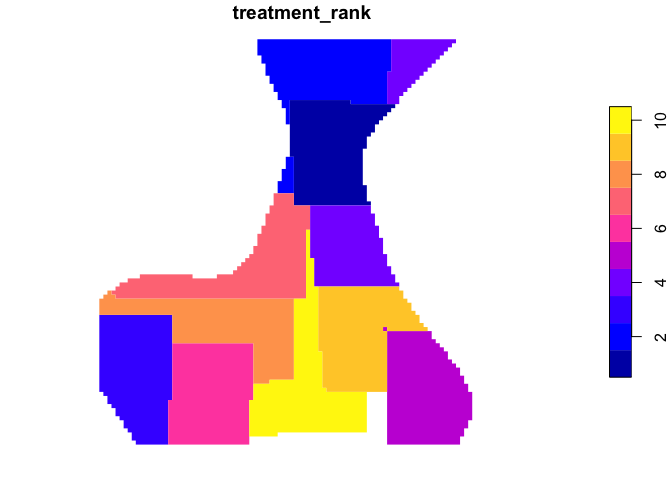

ForSysR
================

<!--- README.md is generated from README.Rmd. Please edit that file -->


## Scenario planning for land management

ForSys a land management planning model that explores potential outcomes
across many possible priorities, including but not limited to landscape
restoration and hazardous fuel management. The model is spatially
explicit and uses multi-criteria prioritization and optimization methods
that can rapidly process scenarios, from small to very large-scales
(\~10,000 acres to more than 180 million acres). The previous iteration
of the ForSys program was called the Landscape Treatment Designer (LTD),
and was used in several published studies. ForSys has been used in
several research and applied case studies at a range of scales
(projects, forests, states, continental United States) to prioritize
landscape-scale treatments (see case studies). ForSys is available in a
windows desktop GUI (ForSysX) and an R version (ForSysR).

## Installation

The current official version of the *forsys* package can be installed
from [GitHub](https://github.com/forsys-sp/forsysr/) using the following
code. Note that in order to use the *patchmax* package, you need to
install that package as well. The current official version of the
*patchmax* package can be installed from
[GitHub](https://github.com/forsys-sp/patchmax/).

We recommend updating other packages when prompted.

``` r
if (!require(remotes)) install.packages("remotes")
remotes::install_github("forsys-sp/forsysr")
remotes::install_github("forsys-sp/patchmax")
```

## Usage

Here we will provide a short example showing how the *forsys* package
can be used to build and solve simple multi-objective landscape
management problems. For brevity, we will use one of the built-in
simulated datasets that is distributed with the package. First, we will
load the *forsys* package.

``` r
library(forsys)

# In order to run the examples below, these additional libraries are required:
library(sf)
library(dplyr)
```

### Loading data

Although *forsys* can support many different types of treatment unit
data, here our treatment units are represented as polygons in a spatial
vector format. Each polygon represents a different treatment unit.

``` r
# load treatment unit data
data(test_forest)
# show the first rows in the attribute table
head(test_forest)
```

    ## Simple feature collection with 6 features and 16 fields
    ## Geometry type: POLYGON
    ## Dimension:     XY
    ## Bounding box:  xmin: -1805472 ymin: 2689815 xmax: -1799472 ymax: 2690815
    ## Projected CRS: NAD83 / Conus Albers
    ##   stand_id proj_id area_ha priority1 priority2 priority3 priority4 threshold1
    ## 1        1      86     100      0.42      0.53      0.48      0.51          1
    ## 2        2      86     100      0.42      0.49      0.48      0.65          1
    ## 3        3      86     100      0.42      0.45      0.48      0.66          1
    ## 4        4      86     100      0.42      0.42      0.48      0.60          1
    ## 5        5      86     100      0.43      0.39      0.48      0.62          1
    ## 6        6      86     100      0.44      0.37      0.48      0.51          1
    ##   threshold2 boundary1 boundary2 cluster1 cluster2 cluster3 mosaic1 mosaic2
    ## 1          1         0         0        0        1        0       2       3
    ## 2          1         0         0        2        1        0       2       3
    ## 3          1         0         0        2        0        0       1       3
    ## 4          1         0         0        2        0        0       1       3
    ## 5          1         0         0        2        0        1       2       3
    ## 6          0         0         0        2        0        1       2       3
    ##                         geometry
    ## 1 POLYGON ((-1805472 2690815,...
    ## 2 POLYGON ((-1804472 2690815,...
    ## 3 POLYGON ((-1803472 2690815,...
    ## 4 POLYGON ((-1802472 2690815,...
    ## 5 POLYGON ((-1801472 2690815,...
    ## 6 POLYGON ((-1800472 2690815,...

``` r
# plot the treatment units
plot(test_forest[,c(4:5,7:10)], border=NA)
```


### Running a ForSys Scenario

*Forsys* prioritizes projects by maximizing an objective given one or
more constraints. The objectives represent one or more management
priorities while the constraints may include a maximum cost or area
treated. Thresholds are environmental or categorical conditions that
trigger the need to treat an indiviudal treatment unit or stand (e.g., a
particular ownership or minimum forest cover). *Forsys* then builds
projects and ranks them in order of their priority. Projects can be
either predefined units (e.g., watersheds) or can be built dynamically.

Let’s set up a very simple *forsys* run to see how things work. We’ll
use the test_forest data shown above. We want to find the top 2000 ha
within each predefined project based on ‘priority1’.

``` r
plot(test_forest[,c('proj_id','priority1')], border=NA)
```

<!-- -->

We run *forsys* with the following arguments. *Forsys* always writes its
outputs to csv files saved within the output folder, but we can
optionally set it to write that data out to a list which has three
elements containing the outputs.

``` r
stand_dat <- test_forest %>% st_drop_geometry()

run_outputs <- forsys::run(
  return_outputs = TRUE,
  scenario_name = "test_scenario",
  stand_data = stand_dat,
  stand_id_field = "stand_id",
  proj_id_field = "proj_id",
  stand_area_field = "area_ha",
  scenario_priorities = "priority1",
  scenario_output_fields = c("area_ha", "priority1", "priority2", "priority3", "priority4"),
  proj_fixed_target =  TRUE,
  proj_target_field = "area_ha",
  proj_target_value = 2000
)
```

Not surprisingly, the treatment rank of the projects selected
corresponds directly to those areas where priority1 was highest, as
plotted below. Projeck rank \#1 (darkest blue) is the highest ranked
project.

``` r
plot_dat <- test_forest %>%
  group_by(proj_id) %>% summarize() %>%
  left_join(run_outputs$project_output %>% select(proj_id, treatment_rank))
plot(plot_dat[,'treatment_rank'], main="Project rank")
```

<!-- -->

Below we plot the stands rather than the project rank and only retain
those stands that were treated.

``` r
plot_dat_2 <- test_forest %>% select(stand_id) %>%
  left_join(run_outputs$stand_output %>% mutate(stand_id = as.integer(stand_id))) %>%
  select(stand_id, priority1, proj_id) %>%
  left_join(run_outputs$project_output %>% select(proj_id, treatment_rank))
plot(plot_dat_2[,c('treatment_rank','priority1')], border=NA)
```

<!-- -->

### Multiple priorities

Next we look at multiple priorities. Plotting priorities 1 and 2 shows
that areas where priority 1 are highest tend to be lower for priority 2.

``` r
plot(test_forest[,c('priority1','priority2')], border=NA)
```

<!-- -->

Let’s see if *forsys* can find locations where we can achieve both
objectives. We prioritize on both variables, priority1 and priority2. We
run *forsys* weighting the two objectives from 0 to 5, which results in
21 scenarios. We then filter the results to observe the outcome of the
scenario where the two objectives are equally weighted. The project rank
graph represents areas that are highest for both priorities.

``` r
run_outputs_3 = forsys::run(
  return_outputs = TRUE,
  scenario_name = "test_scenario",
  stand_data = stand_dat,
  stand_id_field = "stand_id",
  proj_id_field = "proj_id",
  stand_area_field = "area_ha",
  scenario_priorities = c("priority1","priority2"),
  scenario_weighting_values = c("0 5 1"),
  scenario_output_fields = c("area_ha", "priority1", "priority2", "priority3", "priority4"),
  proj_fixed_target =  TRUE,
  proj_target_field = "area_ha",
  proj_target_value = 2000
)
```

Notice we will need to filter the outputs to find the scenario where
each priority is equally weighted. We do this by filtering the priority
scores. Pr_1 indicates the first priority score, and Pr_2 indicates the
second priority score.

``` r
plot_dat_3 <- test_forest %>%
  group_by(proj_id) %>% summarize() %>%
  left_join(run_outputs_3$project_output %>% filter(Pr_1_priority1 == 1 & Pr_2_priority2 == 1) %>% 
              select(proj_id, treatment_rank))

plot(plot_dat_3[,'treatment_rank'], main="Project rank for two priorities")
```

<!-- -->

Alternatively we could pass *forsys* the weighted scenario alone, rather
than running through all the weights and the 21 scenario outcomes. Here
we will utilize the combine_priorities function that we call outside of
the *forsys* run function.

``` r
# Create a new combined priority variable to pass directly to our priority weightings based on priority 1 and priority 2
test_forest <- test_forest %>% forsys::combine_priorities(
  fields = c('priority1','priority2'), 
  weights = c(1,1), 
  new_field = 'combo_priority')

# Recreate our input dataset
stand_dat <- test_forest %>% st_drop_geometry()

# Rerun forsys with the same scenario, passing the combo_priority as the new priority
run_outputs_4 = forsys::run(
  return_outputs = TRUE,
  scenario_name = "test_scenario",
  stand_data = stand_dat,
  stand_id_field = "stand_id",
  proj_id_field = "proj_id",
  stand_area_field = "area_ha",
  scenario_priorities = c("combo_priority"),
  scenario_output_fields = c("area_ha", "priority1", "priority2", "priority3", "priority4"),
  proj_fixed_target =  TRUE,
  proj_target_field = "area_ha",
  proj_target_value = 2000
)

plot_dat_4 <- test_forest %>%
  group_by(proj_id) %>% summarize() %>%
  left_join(run_outputs_4$project_output %>% select(proj_id, treatment_rank))
plot(plot_dat_4[,'treatment_rank'], main="Project rank")
```

<!-- -->

Let’s make this scenario a bit more complex by using a stand threshold
and limiting stand selection to locations where threshold2 = 1 (yellow
areas in the map below).

``` r
plot(test_forest[,c('combo_priority','threshold2')], border=NA)
```

<!-- -->

Let’s run this scenario.

``` r
run_outputs_5 = forsys::run(
  return_outputs = TRUE,
  scenario_name = "test_scenario",
  stand_data = stand_dat,
  stand_id_field = "stand_id",
  proj_id_field = "proj_id",
  stand_area_field = "area_ha",
  stand_threshold = "threshold2 == 1",
  scenario_priorities = c("combo_priority"),
  scenario_output_fields = c("area_ha", "priority1", "priority2", "priority3", "priority4"),
  proj_fixed_target =  TRUE,
  proj_target_field = "area_ha",
  proj_target_value = 2000
)

plot_dat_5 <- test_forest %>%
  group_by(proj_id) %>% summarize() %>%
  left_join(run_outputs_5$project_output %>% select(proj_id, treatment_rank))

plot(plot_dat_5[,'treatment_rank'], main="Project rank for two priorities for threshold2")
```

<!-- -->

### Exploring different project prioritization methods

*Forsys* can build projects dynamically using a package called
*patchmax*, which requires some additional arguments and a shapefile as
the input. Here we will prioritize priority2 and build five 25,000
hectare patches.

``` r
library(patchmax)

# We will set run_with_patchmax to TRUE, then in the run functions we set the search distance weight to 1 to expand the search for high objective stands. We'll limit our search to test only 10% of the stands as patch seeds to speed up our run.
run_outputs_6 = forsys::run(
  return_outputs = TRUE,
  stand_data = test_forest,
  scenario_name = "patchmax_test",
  stand_id_field = "stand_id",
  stand_area_field = "area_ha",
  stand_threshold = "threshold2 >= 1",
  scenario_priorities = "priority2",
  scenario_output_fields = c("area_ha", "priority1", "priority2", "priority3", "priority4"),
  run_with_patchmax = TRUE,
  patchmax_proj_size = 25000,
  patchmax_proj_number = 5,
  patchmax_SDW = 1,
  patchmax_sample_frac = 0.1
)

# Plot treatment rank of patches

plot_dat_6 <- run_outputs_6$stand_output %>% filter(DoTreat == 1) %>%
  mutate(treatment_rank = proj_id, stand_id = as.integer(stand_id))
plot_dat_6 <- test_forest %>% left_join(plot_dat_6 %>% select(stand_id, treatment_rank)) %>%
  group_by(treatment_rank) %>% summarize()
plot(plot_dat_6[,'treatment_rank'], border=NA, main="Patch rank")
```

<!-- -->

## Citation

Please cite the *forsys* package when using it in publications. To cite
the current official version, please use:

> Evers C, Houtman R, Day M, Belavenutti P, and Ager A. (2023). ForSysR:
> A scenario planning platform for modeling multi-criteria spatial
> priorities in R. R package version 0.9. Available at
> <https://github.com/forsys-sp/forsysr>.

## Additional resources

The [package
website](https://www.fs.usda.gov/rmrs/projects/forsys-scenario-planning-model-multi-objective-restoration-and-fuel-management-planning)
contains information on the *forsys* package.

## Getting help

If you have any questions about the *forsys* package or suggestions for
improving it, please [post an issue on the code
repository](https://github.com/forsysr/issues/new).
