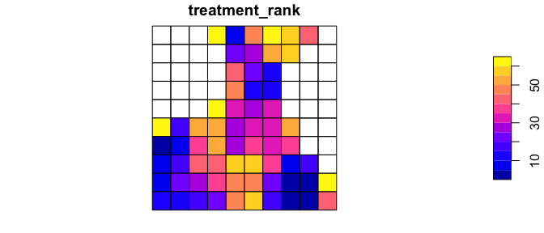
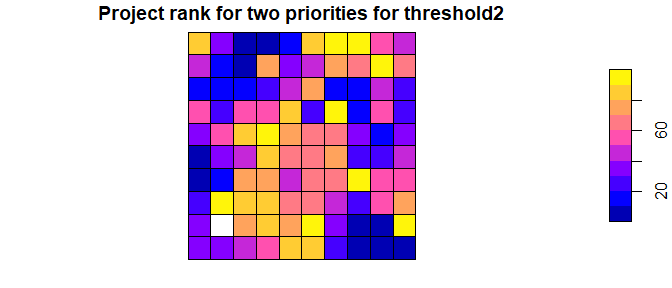

ForSysR
================

<!--- README.md is generated from README.Rmd. Please edit that file -->


## Scenario planning for restoration and fuel treatments

ForSys is a flexible platform for exploring landscape management
scenarios and optimizing decisions in terms of where and how to achieve
landscape restoration and fuel management goals. The model is spatially
explicit and uses multi-criteria prioritization and optimization created
to rapidly design fuel treatment and restoration scenarios. The program
evolved from the Landscape Treatment Designer used in prior studies. The
program has been used in several research and applied case studies at a
range of scales (projects, forests, states, continental United States)
to prioritize projects and stand treatments (see case studies). ForSys
is available in a windows desktop (ForSysX) and R version (ForSysR).

## Installation

The latest official version of the *forsysr* package can be installed
from [GitHub](https://github.com/forsys-sp/forsysr/) using the following
code. Please note that while developmental versions may contain
additional features not present in the official version, they may also
contain coding errors.

``` r
if (!require(remotes)) install.packages("remotes")
remotes::install_github("forsys-sp/forsysr")
```

## Usage

Here we will provide a short example showing how the *forsysr* package
can be used to build and solve a simple multi-objective restoration and
fuel management problems. For brevity, we will use one of the built-in
simulated datasets that is distributed with the package. First, we will
load the *forsysr* package.

``` r
# load package
library(forsys)
```

There are two additional packages required to run the post-processing
forsys code in the following examples.

``` r
# load dplyr and sf packages
library(dplyr)
library(sf)
```

### Loading data

Although the *forsysr* can support many different types of planning unit
data, here our planning units are represented as polygons in a spatial
vector format. Each polygon represents a different planning unit.

``` r
# load planning unit data
data(test_forest)
# show the first rows in the attribute table
head(test_forest)
```

    ## Simple feature collection with 6 features and 10 fields
    ## Geometry type: POLYGON
    ## Dimension:     XY
    ## Bounding box:  xmin: -1805472 ymin: 2689815 xmax: -1799472 ymax: 2690815
    ## Projected CRS: NAD83 / Conus Albers
    ## # A tibble: 6 × 11
    ##   stand_id proj_id area_ha priority1 priority2 priority3 priority4 threshold1
    ##      <int>   <int>   <dbl>     <dbl>     <dbl>     <dbl>     <dbl>      <dbl>
    ## 1        1       1     100     0.417     0.526     0.483     0.513          1
    ## 2        2       1     100     0.418     0.488     0.482     0.646          1
    ## 3        3       1     100     0.419     0.452     0.482     0.661          1
    ## 4        4       1     100     0.422     0.420     0.481     0.604          1
    ## 5        5       1     100     0.428     0.392     0.479     0.621          1
    ## 6        6       1     100     0.438     0.369     0.477     0.514          1
    ## # … with 3 more variables: threshold2 <dbl>, ownership <dbl>,
    ## #   geometry <POLYGON [m]>

``` r
# plot the planning units
plot(test_forest[,c(4:5,7:10)], border=NA)
```


### Preparing the scenario config file

ForSys is easiest to run by referencing a text file saved using json
notation.

``` r
forsys::run(config_file = 'configs/test_forest_config.json')
```

The json config file provides a simple way to save and specify
parameters for running ForSys. These parameters can be pass directly
within the function. See `help(forsys::run)` for the complete arguments

``` r
cat(readLines('configs/test_forest_config.json'), sep='\n')
```

### Running forsysr

ForSys prioritizing projects by maximizing an objective given one or
more constraints. The objective represent one or more priorities while
the constraints may include a maximum cost or area treated. Thresholds
can be set to specify either to define the study area (e.g., a
particular ownership) or based on requirements for treatment (e.g.,
minimum forest cover). ForSys then builds projects and ranks them in
order of their priority. Projects can either predefined units or can be
built dynamically.

Let’s set up a very simple ForSys run to see how things work. We’ll use
the test_forest data shown above. We want to find the top 2000 ha within
each project based on ‘priority1’)

``` r
plot(test_forest[,c('proj_id','priority1')], border=NA)
```

<!-- -->

We run forsys within the following arguments. Remember that these can
also be run using the json config file, as described above. Forsys
always writes its outputs to csv files saved within the output folder,
but we can optionally set it to write that data out to a list which has
three elements containing the outputs.

``` r
stand_dat <- test_forest %>% st_drop_geometry()

run_outputs <- forsys::run(
  return_outputs = TRUE,
  scenario_name = "test_scenario",
  stand_data = stand_dat,
  stand_id_field = "stand_id",
  proj_id_field = "proj_id",
  stand_area_field = "area_ha",
  scenario_priorities = "priority1",
  scenario_output_fields = c("area_ha", "priority1", "priority2", "priority3", "priority4"),
  proj_fixed_target =  TRUE,
  proj_target_field = "area_ha",
  proj_target_value = 2000
)
```

Not surprisingly, the treatment rank of the projects selected correspond
directly to those areas where stands with those priorities are highest.

``` r
plot_dat <- test_forest %>%
  group_by(proj_id) %>% summarize() %>%
  left_join(run_outputs$project_output %>% select(proj_id, treatment_rank))
plot(plot_dat[,'treatment_rank'])
```

<!-- -->

Below we plot the stands rather than the project area and only retain
those stands that were treated.

``` r
plot_dat_2 <- test_forest %>%
  select(stand_id, proj_id) %>%
  inner_join(run_outputs$stand_output %>% select(stand_id, ETrt_YR)) %>%
  left_join(run_outputs$project_output %>% select(proj_id, treatment_rank))
  plot(plot_dat_2[,'treatment_rank'], border=NA)
```

<!-- -->

### Multiple priorities

Next we look at multiple priorities. Plotting priorities 1 and 2 shows
that areas where priority 1 is highest tend to be lower for priority 2.

``` r
plot(test_forest[,c('priority1','priority2')], border=NA)
```

<!-- --> We
prioritize on a new variable called priority_12 which is the product of
priorities 1 and 2. The resulting graph of treatment rank represents
areas that are highest in both priorities.

``` r
stand_dat_3 <- stand_dat %>% mutate(priority_12 = priority1 * priority2)
run_outputs_3 = forsys::run(
  return_outputs = TRUE,
  scenario_name = "test_scenario",
  stand_data = stand_dat_3,
  stand_id_field = "stand_id",
  proj_id_field = "proj_id",
  stand_area_field = "area_ha",
  scenario_priorities = "priority_12",
  scenario_output_fields = c("area_ha", "priority1", "priority2", "priority3", "priority4"),
  proj_fixed_target =  TRUE,
  proj_target_field = "area_ha",
  proj_target_value = 2000
)

plot_dat_3 <- test_forest %>%
  group_by(proj_id) %>% summarize() %>%
  left_join(run_outputs_3$project_output %>% select(proj_id, treatment_rank))
plot(plot_dat_3[,'treatment_rank'])
```

<!-- --> We expand on
this scenario further by limiting stand selection to a single ownership.

``` r
run_outputs_4 = forsys::run(
  return_outputs = TRUE,
  scenario_name = "test_scenario",
  stand_data = stand_dat_3,
  stand_id_field = "stand_id",
  proj_id_field = "proj_id",
  stand_area_field = "area_ha",
  stand_threshold = "ownership == 2",
  scenario_priorities = "priority_12",
  scenario_output_fields = c("area_ha", "priority1", "priority2", "priority3", "priority4"),
  proj_fixed_target =  TRUE,
  proj_target_field = "area_ha",
  proj_target_value = 2000
)

plot_dat_4 <- test_forest %>%
  group_by(proj_id) %>% summarize() %>%
  left_join(run_outputs_4$project_output %>% select(proj_id, treatment_rank = treatment_rank)) 
plot(plot_dat_4[,'treatment_rank'])
```

<!-- -->

### Exploring different project selection methods

Forsys can build projects dynamically using a feature called patchmax,
which requires some additional arguments.

``` r
# first we need to create an object describing stand adjacency
adj = Patchmax::calculate_adj(test_forest, St_id = test_forest$stand_id, method='nb')

run_outputs_5 = forsys::run(
  return_outputs = TRUE,
  stand_data = stand_dat_3,
  scenario_name = "patchmax_test",
  stand_id_field = "stand_id",
  proj_id_field = "proj_id",
  stand_area_field = "area_ha",
  scenario_priorities = "priority1",
  stand_threshold = "ownership == 2",
  scenario_output_fields = c("area_ha", "priority1", "priority2", "priority3", "priority4"),
  scenario_output_grouping_fields = "ownership",
  run_with_patchmax = TRUE,
  patchmax_stnd_adj = adj,
  patchmax_proj_size = 50000,
  patchmax_proj_number = 10,
  patchmax_sample_n = 1000
)

plot_dat_5 <- run_outputs_5$stand_output %>% mutate(treatment_rank = proj_id)
plot_dat_5 <- test_forest %>% left_join(plot_dat_5 %>% select(stand_id, treatment_rank)) %>%
  group_by(treatment_rank) %>% summarize()
plot(plot_dat_5[,'treatment_rank'], border=NA)
```

<!-- -->

## Citation

Please cite the *forsysr* package when using it in publications. To cite
the latest official version, please use:

> Evers C, Houtman R, Day M, Belavenutti P, Lankston R, and Ager A.
> (2022). ForSysR: Systematic Project Planning and Prioritization in R.
> R package version 0.9. Available at
> <https://github.com/forsys-sp/forsysr>.

## Additional resources

The [package
website](https://www.fs.usda.gov/rmrs/projects/forsys-scenario-planning-model-multi-objective-restoration-and-fuel-management-planning)
contains information on the *forsysr* package.

## Getting help

If you have any questions about the *forsysr* package or suggestions for
improving it, please [post an issue on the code
repository](https://github.com/forsysr/issues/new).
