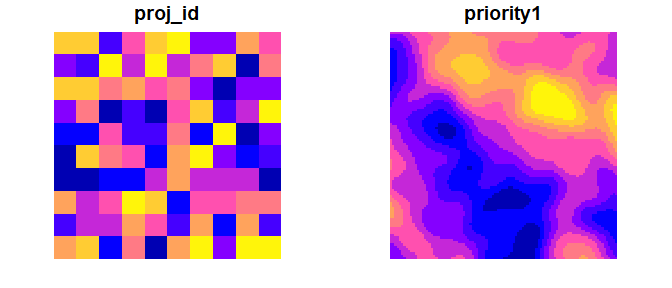

ForSysR
================

<!--- README.md is generated from README.Rmd. Please edit that file -->


# Scenario planning for restoration and fuel treatments

ForSys is a flexible platform for exploring landscape management
scenarios and optimizing decisions in terms of where and how to achieve
landscape restoration and fuel management goals. The model is spatially
explicit and uses multi-criteria prioritization and optimization created
to rapidly design fuel treatment and restoration scenarios. The program
evolved from the Landscape Treatment Designer used in prior studies. The
program has been used in several research and applied case studies at a
range of scales (projects, forests, states, continental United States)
to prioritize projects and stand treatments (see case studies). ForSys
is available in a windows desktop (ForSysX) and R version (ForSysR).

## Installation

The latest official version of the *forsysr* package can be installed
from [GitHub](https://github.com/forsys-sp/forsysr/) using the following
code. Please note that while developmental versions may contain
additional features not present in the official version, they may also
contain coding errors.

``` r
if (!require(remotes)) install.packages("remotes")
remotes::install_github("forsys-sp/forsysr")
```

## Citation

Please cite the *forsysr* package when using it in publications. To cite
the latest official version, please use:

> Evers CR, Ager AA, Day M, Houtman R, Belavenutti P, Lankston R, Bunzel
> K. (2022). ForSysR: Systematic Project Planning and Prioritization in
> R. R package version 1.0. Available at
> <https://github.com/forsys-sp/forsysr>.

## Usage

Here we will provide a short example showing how the *forsysr* package
can be used to build and solve a simple multi-objective restoration and
fuel management problems. For brevity, we will use one of the built-in
simulated datasets that is distributed with the package. First, we will
load the *forsysr* package.

``` r
# load package
library(forsys)
```

Although the *forsysr* can support many different types of planning unit
data, here our planning units are represented as polygons in a spatial
vector format. Each polygon represents a different planning unit.

``` r
# load planning unit data
data(test_forest)
# show the first rows in the attribute table
head(test_forest)
```

    ## Simple feature collection with 6 features and 12 fields
    ## Geometry type: POLYGON
    ## Dimension:     XY
    ## Bounding box:  xmin: -1805472 ymin: 2689815 xmax: -1799472 ymax: 2690815
    ## Projected CRS: NAD83 / Conus Albers
    ## # A tibble: 6 × 13
    ##   stand_id proj_id area_ha priority1 priority2 priority3 priority4 threshold1
    ##      <int>   <int>   <dbl>     <dbl>     <dbl>     <dbl>     <dbl>      <dbl>
    ## 1        1       1     100     0.417     0.526     0.483     0.513          1
    ## 2        2       1     100     0.418     0.488     0.482     0.646          1
    ## 3        3       1     100     0.419     0.452     0.482     0.661          1
    ## 4        4       1     100     0.422     0.420     0.481     0.604          1
    ## 5        5       1     100     0.428     0.392     0.479     0.621          1
    ## 6        6       1     100     0.438     0.369     0.477     0.514          1
    ## # … with 5 more variables: threshold2 <dbl>, ownership <dbl>,
    ## #   geometry <POLYGON [m]>, Project <dbl>, DoTreat <dbl>

``` r
# plot the planning units
plot(test_forest[,c(4:5,7:10)], border=NA)
```



### Preparing the scenario config file

ForSys is easiest to run by referencing a text file saved using json
notation.

``` r
forsys::run(config_file = 'configs/ce_config.json')
```

The json config file provides a simple way to save and specify
parameters for running ForSys. These parameters can be pass directly
within the function. See `help(forsys::run)` for the complete arguments

``` r
cat(readLines('configs/ce_config.json'), sep='\n')
```

### Running forsysr

ForSys is a modular system is constantly being expanded to new planning
problems. In its most general form, ForSys prioritizing projects by
maximizing an objective given one or more constraints. The objective
represent one or more priorities while the constraints may include a
maximum cost or area treated. Thresholds can be set to specify either to
define the study area (e.g., a particular ownership) or based on
requirements for treatment (e.g., minimum forest cover). ForSys then
builds projects and ranks them in order of their priority. Projects can
either predefined units or can be built dynamically.

### Examining results

### Exploring different project selection methods

## Additional resources

The [package
website](https://www.fs.usda.gov/rmrs/projects/forsys-scenario-planning-model-multi-objective-restoration-and-fuel-management-planning)
contains information on the *forsysr* package.

## Getting help

If you have any questions about the *forsysr* package or suggestions for
improving it, please [post an issue on the code
repository](https://github.com/forsysr/issues/new).
